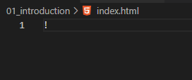
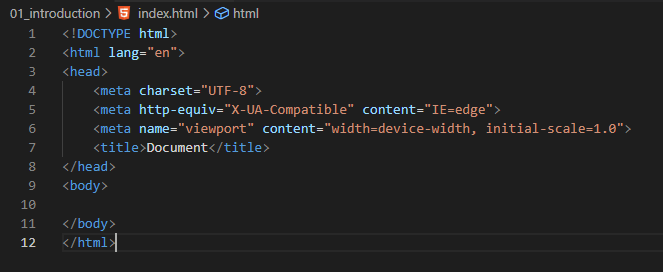
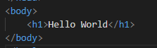

## Explanation

1. Create a html file name index.html.
2. Type "!" to get the boiler plate code for html.  
   
4. Press Enter  
   
5. Add the extension live server in VS code.
6. Now in the body tag type, h1 tag and type "Hello World".  
   
7. Now run it on live server.